手动部署
========================================

在北京区域创建以下对象：

-   3张DynamoDB表，

    -   user-cn存储用户信息，数据将和新加坡区域的user-sg保持同步

    -   loader_stats 表用来统计压测时对user-cn变更的记录数

    -   replicator-stats表用来统计复制完成的记录数，以便监控复制进度

-   User-cn开启DynamoDB stream，用于记录user-cn表的所有变更

-   Kinesis 流ddb_replication_stream_cn：用于记录新加坡区域DynamoDB表user-sg的所有变更
    
-   Lambda函数replicator_kinesis：将北京区域中ddb_replication_stream_cn上的变更记录写入user-cn表
    
-   Lambda 函数ddb_send_to_kinesis：将从北京区域的DynamoDB stream中读取变更记录然后写入到新加坡区域的ddb_replication_stream_sg
    
-   Parameter store中存储新加坡区域IAM用户的AK/SK

-   如果客户有direct connect，可以创建VPC并在VPC内部署一个代理服务器，lambda也部署在VPC内，令lambda利用新加坡区域的代理服务器进而利用direct connect，从而减少网络延迟并提高网络稳定性

在新加坡区域创建以下对象：

-   3张DynamoDB表

    -   user-sg存储用户信息，数据将于北京区域的user-cn保持同步

    -   loader_stats 表用来统计压测时对user-sg变更的记录数

    -   replicator-stats表用来存储复制的变更记录数，以便监控复制进度

-   User-sg开启DynamoDB stream，用于记录user-cn表的所有变更

-   Kinesis stream ddb_replication_stream_sg用于记录北京区域DynamoDB表user-cn的所有变更
    
-   Lambda函数replicator_kinesis将新加坡区域中ddb_replication_stream_sg上的变更记录写入user-sg表
    
-   Lambda 函数ddb_send_to_kinesis将从新加坡区域的DynamoDB stream中读取变更记录然后写入到北京区域的ddb_replication_stream_cn
    
-   Parameter store中存储北京区域IAM用户的AK/SK

-   如果客户有跨境专线连接AWS中国区域和海外区域，可以创建VPC并在VPC内部署一个代理服务器，lambda也部署在VPC内，令lambda利用北京区域的代理服务器进而利用direct connect，从而减少网络延迟并提高网络稳定性

因为对象较多，我们以北京区域DynamoDB表user-cn中的变更数据向新加坡区域同步过程为例，将整个数据流梳理一遍，从新加坡DynamoDB表user-sg同步数据到user-cn的过程类似将不再赘述

-   当数据写入北京区域DynamoDB表user-cn后，变更记录首先会写入北京区域的DynamoDB stream
    
-   北京区域的Lambda ddb_send_to_kinesis将从北京区域的DynamoDB stream中读取变更记录，首先判断记录last_updater_region是否是新加坡区域，如果是就丢弃，不是则写入到新加坡区域的ddb_replication_stream_sg，这一步将跨region，主要的网络延迟就在这一步
    
-   新加坡区域的Lambda replicator_kinesis将新加坡区域中ddb_replication_stream_sg上的变更记录写入user-sg表，在写入时会通过condition判断变更记录的时间戳是否大于当前记录的变更时间戳，只有大于才会写入。
    
-   新加坡区域的user-sg的变化记录又出现在DynamoDB stream中，并被新加坡区域的Lambda ddb_send_to_kinesis读取，而后判断记录的last_updater_region是否是北京区域，因为该变化恰恰是来自北京，所以该记录被丢弃，从而避免了循环复制。

1. 部署环境
--------

### 1.1 准备压测机

#### 网络设置

-   在北京与新加坡区域中各创建一个VPC，记录两个VPC的NAT gateway所对应的EIP。

-   在两个VPC内分别创建一个EC2用作压测机，本DEMO中选择的是c5.large类型实例，为每一个EC2绑定一个EIP。

-   因为篇幅有限，具体步骤请见[《Amazon Virtual Private Cloud用户指南》](https://docs.aws.amazon.com/zh_cn/vpc/latest/userguide/VPC_SecurityGroups.html)，此处不再赘述。

#### 安装软件

1、因为后续操作中会大量使用AWS CLI，故而需要在2个压测服务器上确认安装python3等软件并升级AWS CLI到最新版本，以ec2-user用户运行如下命令：

```bash
yum list installed | grep -i python3
sudo yum install python3 -y
python3 -m venv my_app/env
source ~/my_app/env/bin/activate
pip install pip --upgrade
pip install boto3
echo "source ${HOME}/my_app/env/bin/activate" >> ${HOME}/.bashrc
source ~/.bashrc
pip install faker uuid
pip install --upgrade awscli
```

2、后续模拟加载数据到DynamoDB表的脚本会用到parallel，故而也需要安装parallel

```bash
http://git.savannah.gnu.org/cgit/parallel.git/tree/README
wget https://ftpmirror.gnu.org/parallel/parallel-20200322.tar.bz2
wget https://ftpmirror.gnu.org/parallel/parallel-20200322.tar.bz2.sig
gpg parallel-20200322.tar.bz2.sig
bzip2 -dc parallel-20200322.tar.bz2 | tar xvf -
cd parallel-20200322
./configure && make && sudo make install
```

#### 配置profile

接下来在2个压测服务器上通过aws configure --profile分别配置相应中国区域和Global区域IAM用户的AK/SK，以便后续能顺利运行AWS CLI命令。

### 1.2 建表

#### 新加坡区域

在新加坡区域建立DynamoDB表user-sg，并开启DynamoDB stream（NEW_AND_OLD_IMAGES类型）,设置容量模式为On-Demand。再创建loader_stats和replicator_stats表用来记录更新记录以便比对数据同步进度。

在新加坡区域的压测服务器上通过json创建DynamoDB表，先编写json如下，读者在工作中可以按照实际情况修改相关配置。

```json
vim user-sg.json
{
        "AttributeDefinitions": [
            {
                "AttributeName": "PK",
                "AttributeType": "S"
            }
        ],
       "BillingMode": "PAY_PER_REQUEST",
        "TableName": "user-sg",
        "StreamSpecification": {
            "StreamViewType": "NEW_AND_OLD_IMAGES",
            "StreamEnabled": true
        },
        "KeySchema": [
            {
                "KeyType": "HASH",
                "AttributeName": "PK"
            }
        ]
}
```

然后用命令创建DynamoDB表user-sg

```bash
aws dynamodb create-table --cli-input-json file://user-sg.json
```

最后可以验证

```bash
aws dynamodb describe-table --table-name user-sg
```

用类似方法创建DynamoDB表replicator_stats和loader_stats并且初始化表中的统计值

```json
vim replicator_stats.json
{
        "AttributeDefinitions": [
            {
                "AttributeName": "PK",
                "AttributeType": "S"
            }
        ],
       "BillingMode": "PAY_PER_REQUEST",
        "TableName": "replicator_stats",
        "KeySchema": [
            {
                "KeyType": "HASH",
                "AttributeName": "PK"
            }
        ]
}
aws dynamodb create-table --cli-input-json file://replicator_stats.json
aws dynamodb put-item --table-name replicator_stats --item '{ "PK": {"S":"replicated_count"}, "cnt": {"N":"0"}}'
vim loader_stats.json
{
        "AttributeDefinitions": [
            {
                "AttributeName": "PK",
                "AttributeType": "S"
            }
        ],
       "BillingMode": "PAY_PER_REQUEST",
        "TableName": "loader_stats",
        "KeySchema": [
            {
                "KeyType": "HASH",
                "AttributeName": "PK"
            }
        ]
}
aws dynamodb create-table --cli-input-json file://loader_stats.json
aws dynamodb put-item --table-name loader_stats --item '{ "PK": {"S":"loaded_count"}, "cnt": {"N":"0"}}'
```

#### 北京区域

在北京区域的压测服务器上通过json创建user-cn表，创建方式和前述新加坡区域类似（注意替换表名为user-cn）。再用类似方法创建DynamoDB表replicator_stats和loader_stats （replicator_stats.json及loader_stats.json文件内容和新加坡区域一样）

### 1.3 准备parameter store里的参数

#### 新加坡区域

创建/DDBReplication/TableCN/AccessKey（String）和/DDBReplication/TableCN/SecretKey（SecureString），分别存入中国区用户的AK/SK

```bash
aws ssm put-parameter --name /DDBReplication/TableCN/AccessKey --value <access_key> --type String
aws ssm put-parameter --name /DDBReplication/TableCN/SecretKey --value <secret_key> --type SecureString
```


#### 北京区域

创建/DDBReplication/TableSG/AccessKey
（String）和/DDBReplication/TableSG/SecretKey（SecureString），分别存入Global用户的AK/SK

```bash
aws ssm put-parameter --name /DDBReplication/TableSG/AccessKey --value <access_key> --type String
aws ssm put-parameter --name /DDBReplication/TableSG/SecretKey --value <secret_key> --type SecureString
```

### 1.4 创建SQS

#### 新加坡区域

创建2个标准SQS队列用于Lambda的On-failure Destination。

```bash
aws sqs create-queue --queue-name ddbstreamsg 
aws sqs create-queue --queue-name ddbreplicatorsg
```

#### 北京区域

创建2个标准SQS队列用于Lambda的On-failure Destination。

```bash
aws sqs create-queue --queue-name ddbstreamcn 
aws sqs create-queue --queue-name ddbreplicatorcn
```

### 1.5 创建Kinesis Data Stream

#### 新加坡区域

创建Kinesis Data Stream，因为DEMO中写入量有限，选取一个shard，实际生产中请酌情调整

```bash
aws kinesis create-stream --stream-name ddb_replication_stream_sg --shard-count
1
```

#### 北京区域

创建Kinesis Data Stream，因为DEMO中写入量有限，选取一个shard，实际生产中请酌情调整

```bash
aws kinesis create-stream --stream-name ddb_replication_stream_cn --shard-count
1 
```

### 1.6 创建Lambda role并且授权

请从[iam_role_policy](**iam_policy_example**)处下载相应的json，然后酌情修改相应的权限和用户信息，以备后续步骤创建role。

#### 新加坡区域

需要创建两个role为后续lambda使用

1、将DynamoDB stream中event发送到中国区的Kinesis的lambda需要以下权限：

-   访问DynamoDB stream的权限

-   访问Parameter Store的权限

-   访问lambda On-failure destination的SQS队列的权限

-   访问VPC的权限：这部分权限我们使用现成的policy [AWSLambdaBasicExecutionRole](https://console.amazonaws.cn/iam/home?region=cn-north-1#/policies/arn%3Aaws-cn%3Aiam%3A%3Aaws%3Apolicy%2Fservice-role%2FAWSLambdaBasicExecutionRole)、AWSLambdaVPCAccessExecutionRole

```bash
aws iam create-policy --policy-name ddb_send_to_kinesis_policy --policy-document
file://iam_policy_example/ddb_send_to_kinesis_policy_sg.json
aws iam create-role --role-name ddb_send_to_kinesis_role
--assume-role-policy-document
file://iam_policy_example/lambda-role-trust-policy.json 
aws iam attach-role-policy --role-name ddb_send_to_kinesis_role --policy-arn
arn:aws:iam::aws:policy/service-role/AWSLambdaVPCAccessExecutionRole 
aws iam attach-role-policy --role-name ddb_send_to_kinesis_role --policy-arn
arn:aws:iam::<Global account>:policy/ddb_send_to_kinesis_policy 
```

2、将新加坡Kinesis Data Stream中event写入新加坡区DDB需要以下权限：

-   访问Kinesis Data Stream的权限

-   访问CloudWatch的权限

-   访问user-cn与replicator_stats两个DynamoDB表的权限

-   访问lambda On-failure destination的SQS队列的权限

-   访问VPC的权限：这部分权限我们使用现成的policy [AWSLambdaBasicExecutionRole](https://console.amazonaws.cn/iam/home?region=cn-north-1#/policies/arn%3Aaws-cn%3Aiam%3A%3Aaws%3Apolicy%2Fservice-role%2FAWSLambdaBasicExecutionRole)、AWSLambdaVPCAccessExecutionRole

```bash
aws iam create-policy --policy-name replicator_kinesis_policy --policy-document
file://iam_policy_example/replicator_kinesis_policy_sg.json 
aws iam create-role --role-name replicator_kinesis_role
--assume-role-policy-document file://iam_policy_example/lambda-role-trust-policy.json
aws iam attach-role-policy --role-name replicator_kinesis_role --policy-arn
arn:aws-cn:iam::aws:policy/service-role/AWSLambdaVPCAccessExecutionRole
aws iam attach-role-policy --role-name replicator_kinesis_role --policy-arn
arn:aws:iam::<Global account ID>:policy/replicator_kinesis_policy
aws iam attach-role-policy --role-name replicator_kinesis_role --policy-arn
arn:aws-cn:iam::aws:policy/service-role/AWSLambdaBasicExecutionRole
```

#### 北京区域

需要创建两个role为后续lambda使用

1、将DynamoDB stream中event发送到新加坡区的Kinesis需要以下权限：

-   访问DynamoDB stream的权限

-   访问Parameter Store的权限

-   访问lambda On-failure destination的SQS队列的权限

-   访问VPC的权限：这部分权限我们使用现成的policy
    [AWSLambdaBasicExecutionRole](https://console.amazonaws.cn/iam/home?region=cn-north-1#/policies/arn%3Aaws-cn%3Aiam%3A%3Aaws%3Apolicy%2Fservice-role%2FAWSLambdaBasicExecutionRole)
    、AWSLambdaVPCAccessExecutionRole

```bash
aws iam create-policy --policy-name ddb_send_to_kinesis_policy --policy-document
file://iam_policy_example/ddb_send_to_kinesis_policy_cn.json
aws iam create-role --role-name ddb_send_to_kinesis_role
--assume-role-policy-document file://iam_policy_example/lambda-role-trust-policy.json
aws iam attach-role-policy --role-name ddb_send_to_kinesis_role --policy-arn
arn:aws-cn:iam::aws:policy/service-role/AWSLambdaVPCAccessExecutionRole
aws iam attach-role-policy --role-name ddb_send_to_kinesis_role --policy-arn
arn:aws-cn:iam::<China account ID>:policy/ddb_send_to_kinesis_policy
```

2、将Kinesis Data Stream中event写入DDB需要以下权限：

-   访问Kinesis Data Stream的权限

-   访问CloudWatch的权限

-   访问user-cn与replicator_stats2个DynamoDB表的权限

-   访问lambda On-failure destination的SQS队列的权限

-   访问VPC的权限：这部分权限我们使用现成的policy [AWSLambdaBasicExecutionRole](https://console.amazonaws.cn/iam/home?region=cn-north-1#/policies/arn%3Aaws-cn%3Aiam%3A%3Aaws%3Apolicy%2Fservice-role%2FAWSLambdaBasicExecutionRole) ，AWSLambdaVPCAccessExecutionRole

```bash
aws iam create-policy --policy-name replicator_kinesis_policy --policy-document
file://iam_policy_example/replicator_kinesis_policy_cn.json 
aws iam create-role --role-name replicator_kinesis_role
--assume-role-policy-document
file://iam_policy_example/lambda-role-trust-policy.json 
aws iam attach-role-policy --role-name replicator_kinesis_role --policy-arn
arn:aws-cn:iam::aws:policy/service-role/AWSLambdaVPCAccessExecutionRole
aws iam attach-role-policy --role-name replicator_kinesis_role --policy-arn
arn:aws-cn:iam::\<China account\>:policy/replicator_kinesis_policy 
aws iam attach-role-policy --role-name replicator_kinesis_role --policy-arn
arn:aws-cn:iam::aws:policy/service-role/AWSLambdaBasicExecutionRole 
```

#### （可选）安装代理

在有些实验中，我们发现在跨境公网传输数据时网络时延不稳定。可以通过增加代理服务器利用优化链路达到稳定的时延。在前述的VPC内再建一台EC2，选择实例类型c5.xlarge，并且在EC2上安装代理。这里以Squid为例

以ec2-user运行

```bash
sudo yum install squid
sudo vi /etc/sysctl.conf
net.ipv4.ip_forward = 1
sudo sysctl -p /etc/sysctl.conf
sudo sysctl -a |grep -w ip_forward

grep -n 'http_access deny all' /etc/squid/squid.conf
56:http_access deny all
```

这里修改http_access为allow
all，那么代理服务器的安全组就需要设置为只对lambda所在VPC的NAT网段放行，否则不安全

```bash
grep -n http /etc/squid/squid.conf |grep -w all
56:http_access allow all

sudo vi /etc/squid/squid.conf
http_port 80
sudo systemctl start squid
sudo systemctl status squid
sudo systemctl enable squid.service
```

代理服务器的安全组设定

-   两个区域内代理服务器的安全组中设定只允许对端region lambda所在VPC的NAT Gateway的http/https流量进来。

### 1.7 创建send to kinesis 的lambda函数

#### 新加坡区域

##### 创建lambda

创建python lambda function命名为ddb-send-to-kinesis，上传ddb_send_to_kinesis的Lambda代码，代码请见[send_to_kinesis.py](https://github.com/aws-samples/aws-dynamodb-cross-region-replication/blob/master/send_to_kinesis.py)

```bash
zip send_kinesis.zip send_to_kinesis.py

aws lambda create-function --role arn:aws:iam::<Global
account ID>:role/ddb_send_to_kinesis_role --runtime python3.7 --function-name
ddb_send_to_kinesis --handler send_to_kinesis.lambda_handler --zip-file
fileb://send_kinesis.zip --timeout 60 
```

##### 设置环境变量

为lambda添加五个环境变量，第一个用来从parameter store中获取中国区的Access Key和Secret Key的路径

| **Key**                     | **Value**                          |
|-----------------------------|------------------------------------|
| PARAMETER_STORE_PATH_PREFIX | /DDBReplication/TableCN/           |
| TARGET_REGION               | cn-north-1                         |
| TARGET_STREAM               | ddb_replication_stream_cn          |
| USE_PROXY                   | FALSE                              |
| PROXY_SERVER                | \<China region proxy IP\>:\<port\> |

```bash
aws lambda update-function-configuration --function-name ddb_send_to_kinesis
--environment "Variables={PARAMETER_STORE_PATH_PREFIX=/DDBReplication/TableCN/, TARGET_REGION=cn-north-1, TARGET_STREAM=ddb_replication_stream_cn,USE_PROXY=FALSE,PROXY_SERVER=<China region proxy IP>:<port>}"
```

##### 创建触发器

通过lambda页面选中ddb_send_to_kinesis，而后选择add trigger，下拉框中选择DynamoDB，而后填写以下信息：

-   从DynamoDB console获取我们开启的DDB stream的ARN，填写到DDB table处

-   将SQS：ddbstreamsg的arn填写到On-failure destination处

-   Concurrent batches per shard设为10

-   Batch size设为500

-   Retry attempts: 300

-   Maximum age of record: 1 Day

-   Timeout设置为1分钟

通过命令查询

```bash
aws lambda list-event-source-mappings --function-name ddb_send_to_kinesis
```

##### 将lambda置于VPC内

在lambda页面选中ddb_send_to_kinesis，在VPC界面进行设置，选中两个AZ中的私有子网，并选择预先设置好security
group，向北京区代理服务器的EIP网段开放http/https接口

#### 北京区域

##### 创建lambda

创建python lambda function命名为ddb-send-to-kinesis，上传ddb_send_to_kinesis的Lambda代码，编辑send_to_kinesis.py，代码请见[send_to_kinesis.py](https://github.com/aws-samples/aws-dynamodb-cross-region-replication/blob/master/send_to_kinesis.py)

```bash
zip send_kinesis.zip send_to_kinesis.py

aws lambda create-function --role arn:aws-cn:iam::<China account>:role/ddb_send_to_kinesis_role --runtime python3.7 --function-name ddb_send_to_kinesis --handler send_to_kinesis.lambda_handler --zip-file fileb://send_kinesis.zip --timeout 60
```

##### 设置环境变量

为lambda添加五个环境变量，第一个用来从parameter store中获取中国区的Access Key和Secret Key的路径

| **Key**                     | **Value**                              |
|-----------------------------|----------------------------------------|
| PARAMETER_STORE_PATH_PREFIX | /DDBReplication/TableSG/               |
| TARGET_REGION               | ap-southeast-1                         |
| TARGET_STREAM               | ddb_replication_stream_sg              |
| USE_PROXY                   | FALSE                                  |
| PROXY_SERVER                | \<Singapore region proxy IP\>:\<port\> |

```bash
aws lambda update-function-configuration --function-name ddb_send_to_kinesis
--environment "Variables={PARAMETER_STORE_PATH_PREFIX=/DDBReplication/TableSG/, TARGET_REGION=ap-southeast-1, TARGET_STREAM=ddb_replication_stream_sg, USE_PROXY=FALSE, PROXY_SERVER=<Singapore region proxy IP>:<port>}"
```

##### 创建触发器

通过lambda页面选中ddb_send_to_kinesis，而后选择add trigger，下拉框中选择DynamoDB，而后填写以下信息：

-   从DynamoDB console获取我们开启的DDB stream的arn，填写到DDB table处

-   将SQS：ddbstreamcn的arn填写到On-failure destination处

-   Concurrent batches per shard设为10

-   Batch size设为500

-   Retry attempts: 300

-   Maximum age of record: 1 Day。

-   Timeout设置为1分钟

```bash
aws lambda list-event-source-mappings --function-name ddb_send_to_kinesis
```

##### 将lambda置于VPC内

在lambda页面选中ddb_send_to_kinesis，在VPC界面进行设置，选中两个AZ中的私有子网，并选择预先设置好security
group，向新加坡区代理服务器的EIP网段开放http/https接口

### 1.8 创建消费Kinesis Stream的Lambda函数

#### 新加坡区域

##### 创建lambda

创建python lambda function命名为replicator_kinesis，上传replicator_kinesis的Lambda代码，代码请见[replicator_kinesis.py](https://github.com/aws-samples/aws-dynamodb-cross-region-replication/blob/master/replicator_kinesis.py)

```bash
zip replicator_kinesis.zip replicator_kinesis.py

aws lambda create-function --role arn:aws:iam::<Global account>:role/replicator_kinesis_role --runtime python3.7 --function-name replicator_kinesis --handler replicator_kinesis.lambda_handler --zip-file fileb://replicator_kinesis.zip --timeout 60
```

##### 设置环境变量

```bash
aws lambda update-function-configuration --function-name replicator_kinesis --environment "Variables={TARGET_TABLE=user-sg}"
```

##### 创建触发器

通过lambda页面选中replicator_kinesis，而后选择add trigger，下拉框中选择Kinesis，而后填写以下信息：

-   下拉菜单中选取ddb_replication_stream_sg

-   将SQS：ddbreplicatorsg的arn填写到On-failure destination处

-   Concurrent batches per shard：10

-   Batch size：500

-   Retry attempts:100

#### 北京区域

##### 创建lambda

创建python lambda function命名为replicator_kinesis，上传replicator_kinesis的Lambda代码，代码请见[replicator_kinesis.py](https://github.com/aws-samples/aws-dynamodb-cross-region-replication/blob/master/replicator_kinesis.py)

```bash
zip replicator_kinesis.zip replicator_kinesis.py

aws lambda create-function --role arn:aws-cn:iam::<China account>:role/replicator_kinesis_role --runtime python3.7 --function-name replicator_kinesis --handler replicator_kinesis.lambda_handler --zip-file fileb://replicator_kinesis.zip --timeout 60
```

##### 设置环境变量

```bash
aws lambda update-function-configuration --function-name replicator_kinesis --environment "Variables={TARGET_TABLE=user-cn}"
```

##### 创建触发器

通过lambda页面选中replicator_kinesis，而后选择add trigger，下拉框中选择Kinesis，而后填写以下信息：

-   下拉菜单中选取ddb_replication_stream_cn

-   将SQS：ddbreplicatorcn的arn填写到On-failure destination处

-   Concurrent batches per shard：10

-   Batch size：500

-   Retry attempts:100

2 测试
-------

### 2.1 准备加载数据脚本

在北京和新加坡的代理服务器上，生成load_items.py,代码请见[load_items.py](https://github.com/aws-samples/aws-dynamodb-cross-region-replication/blob/master/load_items.py)

### 2.2 测试

单进程加载执行

```bash
python3 load_items.py -n 20000 -t <table name> -r <region name>
```

其中：

-   \-n后的参数是加载记录数量，本例中是加载20000条记录
-   -t后是表名
-   \-r后是指定区域

多进程并发加载可以执行

```bash
seq 5 | parallel -N0 --jobs 0 "python3 load_items.py -n 20000 -t <table name> -r <region name>"
```

其中：

-   seq后是并发数，本例中选择5个并发进程，每个加载20000行数据

为了模拟两个region同时有大量本地写DynamoDB的场景，我们在北京和新加坡的压测机上同时运行并发加载测试。

在运行过程中，我们可以通过监控DynamoDB表的Write Capacity图表，可以看到WCU达到了500以上。值得注意的是，在双向复制的测试中，既有压测进程在写入DynamoDB表，同时有lambda在复制来自对端的数据，因此观察到的WCU是两者的叠加。如果是同样测试条件下做单向复制的测试，那会观察到WCU大约是前者的一半。

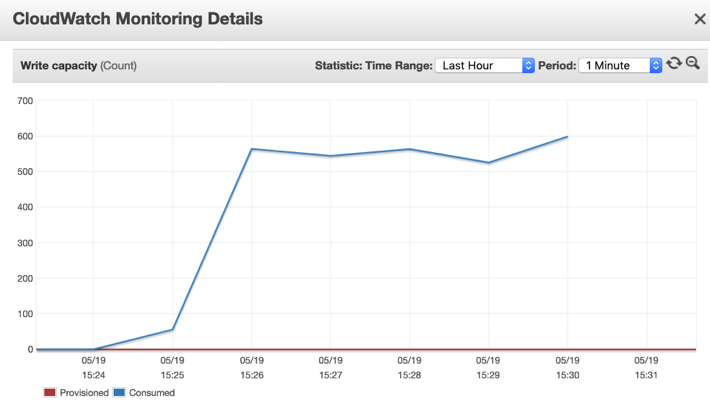

### 2.3 监控lambda

通过lambda console的monitor对lambda运行情况进行监控，以下几个指标要关注。

以下截图的产生背景是：在中国区压测机上用5个进程模拟向user-cn表插入记录，每个进程插入20000条，总计100000条记录，最终执行时间大概是5分:29秒，实际生产环境中的监控图可能有很大变化。

#### Invocations

函数代码的执行次数，包括成功的执行和导致出现函数错误的执行。如果调用请求受到限制或导致出现[调用错误](https://docs.aws.amazon.com/zh_cn/lambda/latest/dg/API_Invoke.html#API_Invoke_Errors)，则不会记录调用。这等于计费请求的数目。这里可以看到中国区ddb_send_to_kinesis的调用次数明显比新加坡区replicator_kinesis调用次数高，可以通过cloudwatch logs查看2个lambda运行日志找到原因，我们可以看到ddb_send_to_kinesis因为是跨region写入记录，所以网络延迟导致每批次处理记录要比同region的replicator_kinesis的每批次处理记录要少得多，故而相应地调用次数也要多得多。

**中国区ddb_send_to_kinesis**

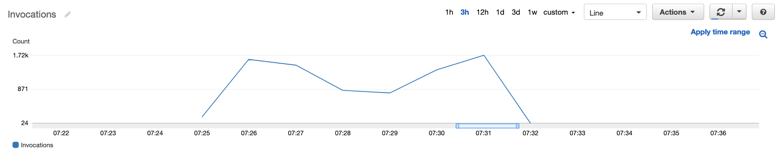

**新加坡区replicator_kinesis**


#### Duration

函数代码处理事件所花费的时间量。对于由函数实例处理的第一个事件，该时间量包括[初始化时间](https://docs.aws.amazon.com/zh_cn/lambda/latest/dg/gettingstarted-features.html#gettingstarted-features-programmingmodel)。调用的计费持续时间是已舍入到最近的100 毫秒的 Duration值。因为ddb_send_to_kinesis是跨region写入记录，所以网络延迟导致其花费时间要比replicator_kinesis时间长一些。

**中国区ddb_send_to_kinesis**

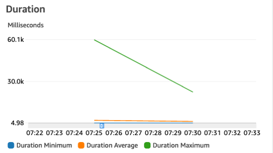

**新加坡区replicator_kinesis**

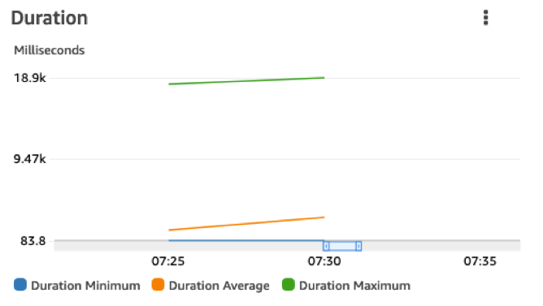

#### Error count and success rate (%)

Errors – 导致出现函数错误的调用的次数。函数错误包括您的代码所引发的异常和 Lambda运行时所引发的异常。运行时返回因超时和配置错误等问题导致的错误。错误率即通过Errors 的值除以 Invocations的值计算而得。我们可以看到ddb_send_to_kinesis因为是跨region写入记录，所以网络可能导致部分失败。

**中国区ddb_send_to_kinesis**

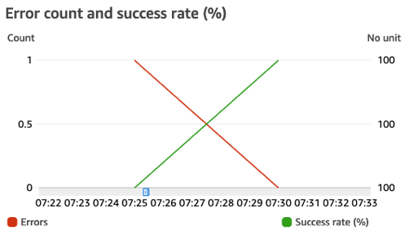

**新加坡区replicator_kinesis**

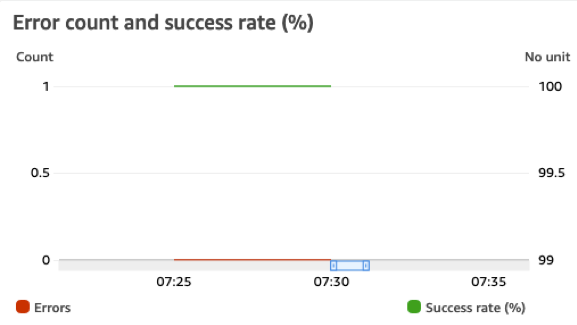

#### IteratorAge

对于从流读取的[事件源映射](https://docs.aws.amazon.com/zh_cn/lambda/latest/dg/invocation-eventsourcemapping.html)，为事件中最后一条记录的期限。期限是指流接收记录的时间到事件源映射将事件发送到函数的时间之间的时间量。我们可以看到ddb_send_to_kinesis因为是跨region写入记录有网络延迟，所以IteratorAge会比replicator_kinesis长一些。

**中国区ddb_send_to_kinesis**

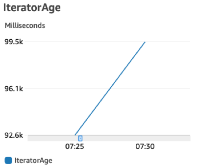

**新加坡区replicator_kinesis**

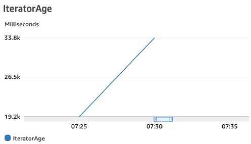

#### Concurrent executions

正在处理事件的函数实例的数目。如果此数目达到区域的[并发执行限制](https://docs.aws.amazon.com/zh_cn/lambda/latest/dg/gettingstarted-limits.html)或您在函数上配置的[预留并发限制](https://docs.aws.amazon.com/zh_cn/lambda/latest/dg/configuration-concurrency.html)，则其他调用请求将受到限制。我们可以看到ddb_send_to_kinesis因为源头DDB stream是多个shard（因为源DDB是on demand且记录数较多），所以他并发有40个，而replicator_kinesis的源头kinesis stream我们只有一个shard所以并发只有10个。

**中国区ddb_send_to_kinesis**

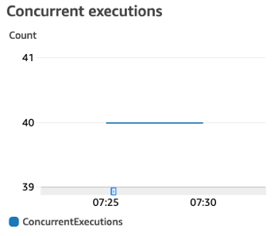

**新加坡区replicator_kinesis**

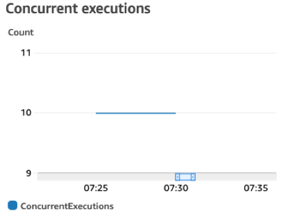

### 2.4 通过replicator_stats记录复制数量

在本实验中，为了方便查询复制记录的总数，每当load_items.py向名为user-\*的DynamoDB表中加载记录都会向本region的loader_stats表中记录加载记录数，此后每当对端region的lambda [replicator_kinesis]向同region名为user-\*的DynamoDB表中成功写入记录时就会累加在replicator_stats表的replicated_count值，故而可以通过比较replicator_stats表的replicated_count值与load_items中插入的记录总数来掌握整个复制进度。

譬如我在中国区压测机上用5个进程模拟向user-cn表插入记录，每个进程插入20000条，总计100000条记录，可以在中国区的loader_stats表中看到插入条目统计值为100000。并且，我们从北京区的loader_stats以及新加坡区的replicator_stats中可以看到加载和复制完成记录数。

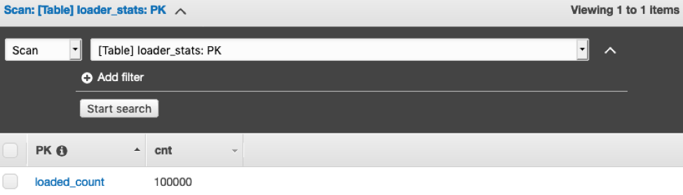

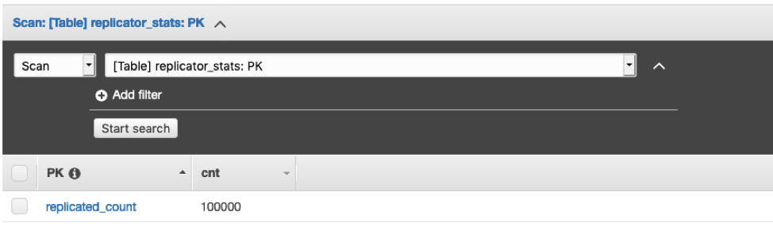

### 2.5 Cloudwatch监控指标

在通过load_items.py向DynamoDB表中加载数据时会向cloudwatch中输出metrics Total_loaded，该metrics会记录每个load_items.py加载数据的总数，通过cloudwatch的console我们可以图形化展示该metrics，可以在**CloudWatch Metrics-\>DDB-Loader-\>loader**找到这个图表。下图选取的是10秒周期内Total_loaded的最大值（因为该值总是单调递增），我们可以从中掌握加载数据的情况。

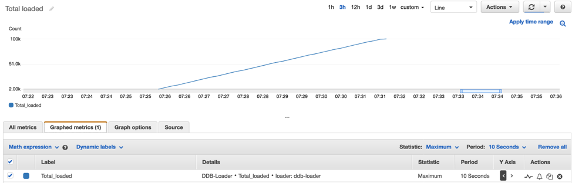

在通过replicator_kinesis lambda向DynamoDB表中加载数据时同样会向cloudwatch中输出2个metrics ，其中：

-   **Total_replicated** 记录了向目标DynamoDB表中复制数据的总量

-   **Updated_count** 记录了每次调用lambda复制数据的数量

过Cloudwatch的console我们可以图形化展示2个metrics，下图Total_replicated选择30秒周期内的最大值，我们可以从中掌握复制数据的情况，而Updated_count选择总数可以从曲线中判断复制速率是否稳定，如果波动较大，要考虑是否网络或者程序出现问题。

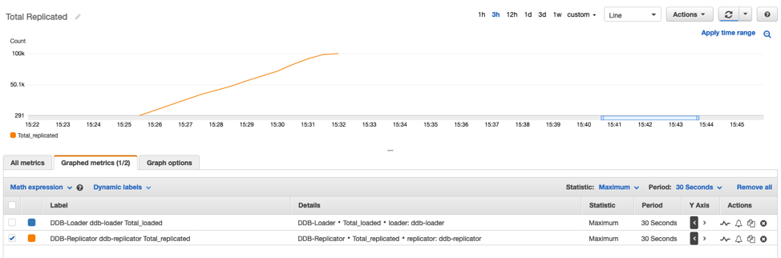

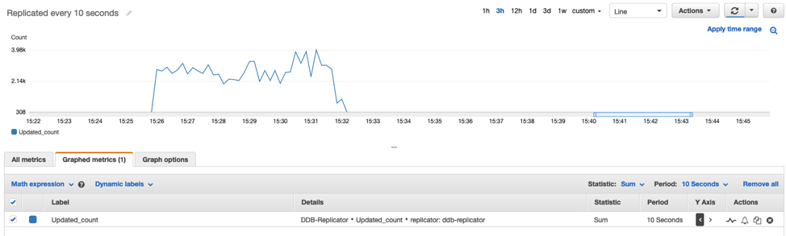

另外，我们可以比较Total_loaded和Total_replicated的时间点来分析复制的时延。在这个实验中，压测机在07:31:42UTC时间完成测试，Total_loaded达到100K条，而复制端在07：32：16UTC时间复制完成，达到100K条，总体时延34秒。
